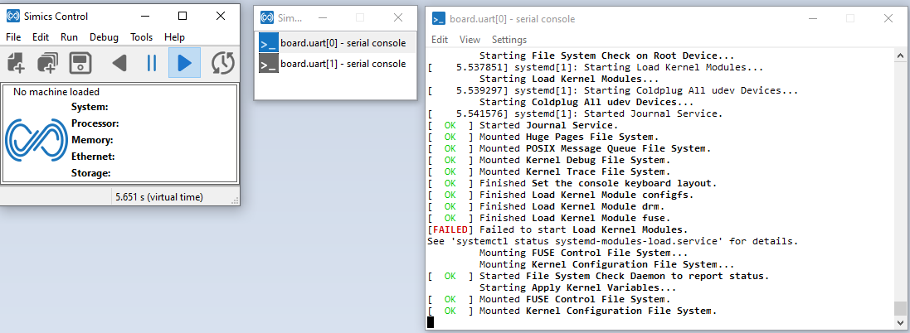

## Build Debian RISC-V Port Image
```
git clone git@github.com:intel-sandbox/xzhang84.riscv-rootfs-builder.git
git checkout -m e267cac3b5d6d323ea48f09ff3bfa0416fea8eb6
cd thirdparty/debian
./create_debian_image.sh
```
The image debian-sid-riscv.img will be created. Please note currently for Debian RISC-V is not an official architecture, so the image is based on Debian Unstable release.
```
./run_qemu.sh
```

## Download and install Simics packages

Three Simics packages are needed for Horse Creek platform. Please download these packages from the Linux Public packages.

Simics Base (1000), version 1000-6.0.137
RISC-V CPU (2050), version 2050-6.0.pre38
HorseCreek platform (2011), version 2011-6.0.pre6

Create an account the same name is your idsid in the ubuntu system. The install-simics.pl script will use idsid accout to login. Here my idsid is yli147
```
sudo adduser yli147
sudo usermod -aG sudo yli147
su yli147
```

```
mkdir ~/simics
cd ~/simics
wget https://ubit-artifactory-sh.intel.com/artifactory/simics-repos/pub/simics-6/linux64/simics-pkg-1000-6.0.137-linux64.tar
wget https://ubit-artifactory-sh.intel.com/artifactory/simics-repos/pub/simics-6/linux64/simics-pkg-2011-6.0.pre6-linux64.tar
wget https://ubit-artifactory-sh.intel.com/artifactory/simics-repos/pub/simics-6/linux64/simics-pkg-2050-6.0.pre38-linux64.tar
tar xf simics-pkg-1000-6.0.137-linux64.tar
tar xf simics-pkg-2011-6.0.pre6-linux64.tar
tar xf simics-pkg-2050-6.0.pre38-linux64.tar
cd simics-6-install
sudo apt install krb5-user
```

Edit /etc/krb5.conf, change [libdefaults] default_realm to default_realm = CCR.CORP.INTEL.COM, or your account's own region.

```
sudo apt-get install smbclient
./install-simics.pl
```

## Create Horse Creek project
```
cd ~/simics
./simics-6/simics-6.0.137/bin/project-setup hrc
mkdir hrc/targets/riscv-horsecreek/images

git clone https://github.com/xzhangxa/applications.simulators.simics.platform-sw.buildroot.git -b dev
cd ./applications.simulators.simics.platform-sw.buildroot
git checkout -m cafe8c0d1a182d84a25f5a277921ffc900c11c76
make horsecreek_debian_defconfig
Or, build the kernel based on Ubuntu's kernel configs
make horsecreek_ubuntu_defconfig
make
cp output/images/Image ~/simics/hrc/targets/riscv-horsecreek/images
cp output/images/horsecreek.dtb ~/simics/hrc/targets/riscv-horsecreek/images

Copy the Debian image to the ~/simics/hrc/targets/riscv-horsecreek/images

(optional) Copy extra modules to the image: use Debian image as example, and assume /dev/loop0 is mapped
sudo losetup --partscan --find --show ~/simics/hrc/targets/riscv-horsecreek/images
mkdir rootfs
sudo mount /dev/loop0p1 rootfs
sudo cp -r output/target/lib/modules/5.17.0 ./rootfs/lib/modules
sudo umount rootfs
rm -r rootfs
sudo losetup -d /dev/loop0

cd ..
git clone https://github.com/riscv-software-src/opensbi.git
cd opensbi
git checkout -m 48f91ee9c960f048c4a7d1da4447d31e04931e38
export CROSS_COMPILE=riscv64-linux-gnu-
make PLATFORM=generic FW_JUMP_ADDR=0x2000200000 FW_JUMP_FDT_ADDR=0x2002200000
cp build/platform/generic/firmware/fw_jump.bin ~/simics/hrc/targets/riscv-horsecreek/images
```

## Modify target file for final setup
Make sure the Debian image to the ~/simics/hrc/targets/riscv-horsecreek/images
```
cp ~/simics/simics-6/simics-6.0.137/../simics-riscv-horsecreek-6.0.pre6/targets/riscv-horsecreek/* ~/simics/hrc/targets/riscv-horsecreek/
```
Modify the file ~/simics/hrc/targets/riscv-horsecreek/linux.simics to add line default sata_disk_image = "%simics%/targets/riscv-horsecreek/images/debian-sid-riscv.img" under params from "%simics%/targets/riscv-horsecreek/system.include".

## Run in Linux
In SSH or VNC environment
```
cd ~/simics/hrc
unset DISPLAY
./simics targets/riscv-horsecreek/linux.simics
 simics> run
After bootup
 simics> board.console.con.host-serial-setup
A visual pts device will be opened eg:
[board.console.con info] Device opened: /dev/pts/4
"/dev/pts/4"
 ```
From another console 
```
sudo minicom -D /dev/pts/4 -s 115200
```

## Run in Windows

Down the simics x64 installer from https://wiki.ith.intel.com/display/Simics/Simics+Package+Manager

Install the simics-pkg-1000-6.0.137， simics-pkg-2011-6.0.pre6，simics-pkg-2050-6.0 in "Intel Simics Package Manager"

Create horse-creek project in "My Projects"  with RISCV-HorseCreek(2011) and RISC-V-CPU(2050) packages selected


Copy all the riscv-horsecreek from linux system to the targets/riscv-horsecreek and Open the PowerShell
```
cd to the simics folder
./simics targets/riscv-horsecreek/linux.simics
 simics> run
After bootup, double click the board.uart0 in the second prompted simics window
```

