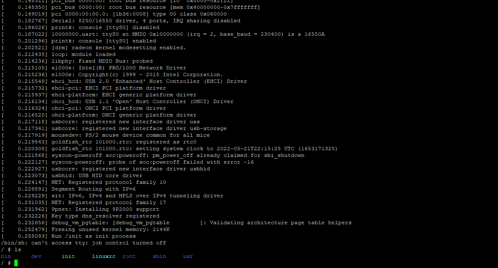

# Quick Start to RSIC-V
This is a initial BKM summary for RSIC-V.

- [RSIC-V Information](#rsic-v-information)
- [Quick Start Guide RSIC-V Linux on QEMU](#quick-start-guide-rsic-v-linux-on-qemu)

## RSIC-V Information
### Specs
  [ISA Specification] https://github.com/riscv/riscv-isa-manual/releases/download/Ratified-IMAFDQC/riscv-spec-20191213.pdf
	https://github.com/riscv/riscv-isa-manual/releases/download/Priv-v1.12/riscv-privileged-20211203.pdf
  
  [Debug Specification]
	https://github.com/riscv/riscv-debug-spec

  [Trace Specification]
	https://github.com/riscv/riscv-trace-spec
	

### Univerisy Courses:
	https://cornellcswiki.gitlab.io/classes/CS3410.html
	
### Web ISA Simulators
	https://ascslab.org/research/briscv/simulator/simulator.html
	https://github.com/magic3007/RISCV-Simulator
	https://www.cs.cornell.edu/courses/cs3410/2019sp/riscv/interpreter/


### OpenSource RTL for FPGA build
	https://github.com/ultraembedded/riscv
	https://www.cnx-software.com/2021/11/24/sipeed-licheerv-a-low-cost-allwinner-d1-linux-risc-v-board/
	https://www.indiegogo.com/projects/nezha-your-first-64bit-risc-v-linux-sbc-for-iot
	https://www.sifive.com/boards/hifive-unmatched
	https://wiki.debian.org/RISC-V
	
### ToolChain Code
	https://github.com/riscv-collab/riscv-gnu-toolchain
	https://github.com/riscv-collab/riscv-gnu-toolchain/blob/master/README.md
	http://www.openv.cc/archives/1
	
	Compile it manually as described in the following article: https://programmersought.com/article/4626958334/
Get the latest build from bootlin.

	# sudo apt install gcc-riscv64-unknown-elf
	# sudo apt install gcc-riscv64-linux-gnu
	Other libs to be build in toolchain
    	riscv-binutils: The binary utilities
    	riscv-dejagnu: The testing framework
    	riscv-gcc: The core C compiler
    	riscv-gdb: The GNU debugger
    	riscv-glibc: The Posix standard C library
    	riscv-newlib: The bare-metal standard C library	
	qemu: The RISCV emulator
	

## Quick Start Guide RSIC-V Linux on QEMU
How To Set Up The Environment for RISCV-64 Linux Kernel Development In Ubuntu 20.04.3

### Operation System
Linux distribution (Ubuntu 20.04.3 LTS)

	intel@intel-NUC11PHi7:~/workspace$ lsb_release -a
	No LSB modules are available.
	Distributor ID: Ubuntu
	Description:    Ubuntu 20.04.3 LTS
	Release:        20.04
	Codename:       focal


### Prerequisites
1. Install gcc-riscv64    
	```bash
    $ sudo apt install autoconf automake autotools-dev curl libmpc-dev libmpfr-dev libgmp-dev gawk build-essential bison flex texinfo gperf libtool patchutils bc zlib1g-dev libexpat-dev git
	$ sudo apt install libpixman-1-0
	$ sudo apt-get install -y gcc-riscv64-linux-gnu
	$ sudo apt install -y gcc-riscv64-unknown-elf
	```
2. Get the latest build from bootlin
	```bash
	$ wget https://toolchains.bootlin.com/downloads/releases/toolchains/riscv64/tarballs/riscv64--glibc--bleeding-edge-2020.08-1.tar.bz2
	$ sudo mkdir -p /opt/bootlin
	$ sudo tar jxf riscv64--glibc--bleeding-edge-2020.08-1.tar.bz2 -C /opt/bootlin/
	```
	
### Build QEMU
1. QEMU v5.2.0
    ```bash
    $ git clone https://github.com/qemu/qemu
	$ cd qemu
	$ git checkout v5.2.0
	$ sudo apt install ninja-build
	$ ./configure --target-list=riscv64-softmmu
	$ make -j $(nproc)
	$ sudo make install
	$ cd ..
    ```
	
### Build Linux
1. Linux v5.11
    ```bash
    $ git clone https://github.com/torvalds/linux
	$ cd linux 
	$ git checkout -b risc-v v5.11
	$ make ARCH=riscv CROSS_COMPILE=/opt/bootlin/riscv64--glibc--bleeding-edge-2020.08-1/bin/riscv64-buildroot-linux-gnu- defconfig
	$ make ARCH=riscv CROSS_COMPILE=/opt/bootlin/riscv64--glibc--bleeding-edge-2020.08-1/bin/riscv64-buildroot-linux-gnu- -j $(nproc)
	$ cd ..
    ```

### Build BusyBox
1. BusyBox v1.31.1
	```bash
    $ wget https://busybox.net/downloads/busybox-1.31.1.tar.bz2
	$ tar jxvf busybox-1.31.1.tar.bz2
	$ cd busybox-1.31.1
	   ** Here MUST apply patch https://git.busybox.net/busybox/commit/?id=d3539be8f27b8cbfdfee460fe08299158f08bcd9 to solve the link error
	$ CROSS_COMPILE=/opt/bootlin/riscv64--glibc--bleeding-edge-2020.08-1/bin/riscv64-buildroot-linux-gnu- make defconfig
	$ CROSS_COMPILE=/opt/bootlin/riscv64--glibc--bleeding-edge-2020.08-1/bin/riscv64-buildroot-linux-gnu- make menuconfig
	   ** Build static binary (no shared libs)
	```	   
	
	
	```bash
	$ CROSS_COMPILE=/opt/bootlin/riscv64--glibc--bleeding-edge-2020.08-1/bin/riscv64-buildroot-linux-gnu- make -j $(nproc)
	$ CROSS_COMPILE=/opt/bootlin/riscv64--glibc--bleeding-edge-2020.08-1/bin/riscv64-buildroot-linux-gnu- make install
    	```
 
 
### Create RamDISK
1. RAM RootFs
	```bash
    $ cd busybox-1.31.1/_install
	$ mkdir -p dev
	$ sudo mknod dev/console c 5 1
	$ sudo mknod dev/ram b 1 0
	$ touch init
	$ vim init
		#!/bin/sh
		echo "### INIT SCRIPT ###"
		mkdir /proc /sys /tmp
		mount -t proc none /proc
		mount -t sysfs none /sys
		mount -t tmpfs none /tmp
		echo -e "\nThis boot took $(cut -d' ' -f1 /proc/uptime) seconds\n"
		exec /bin/sh
	$ chmod a+x init
	$ chown root:root init
	$ chown root:root dev
	$ find -print0 | cpio -0oH newc | gzip -9 > ../../initramfs.cpio.gz
	cd ../../
    ```

# RUN
1. Lauch Linux in RSICV-QEMU with BusyBox 	
	```bash
	$ sudo ./qemu/build/qemu-system-riscv64 -nographic -machine virt -kernel ./linux/arch/riscv/boot/Image -initrd initramfs.cpio.gz -append "root=/dev/vda ro console=ttyS0"
	```
	
	
	
